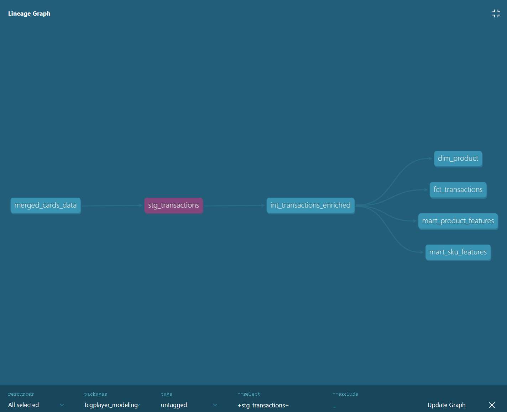
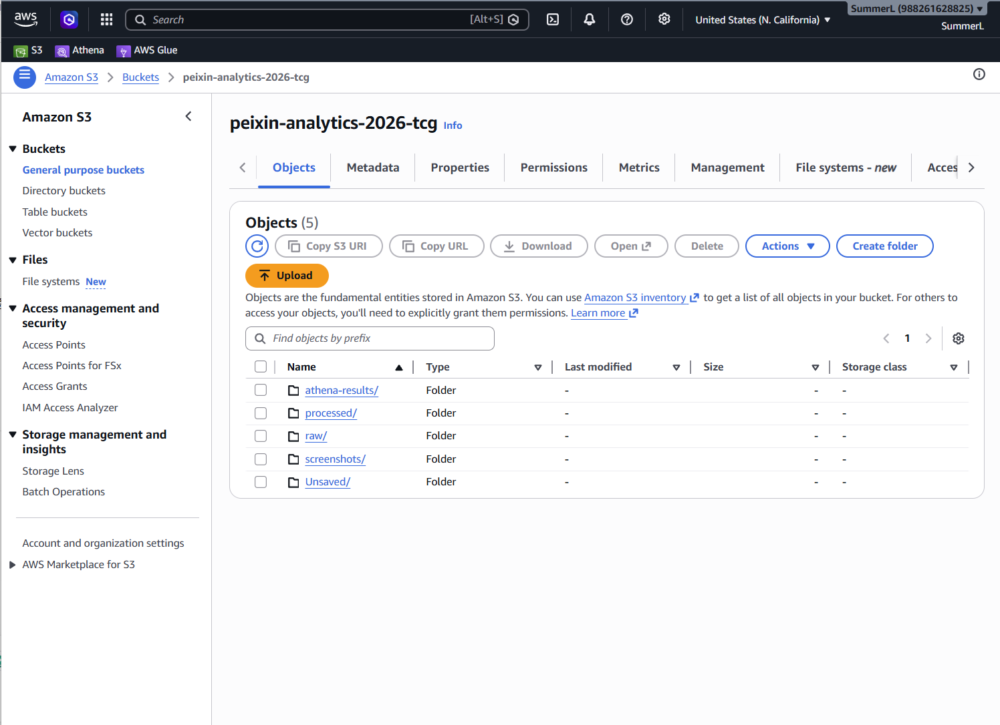
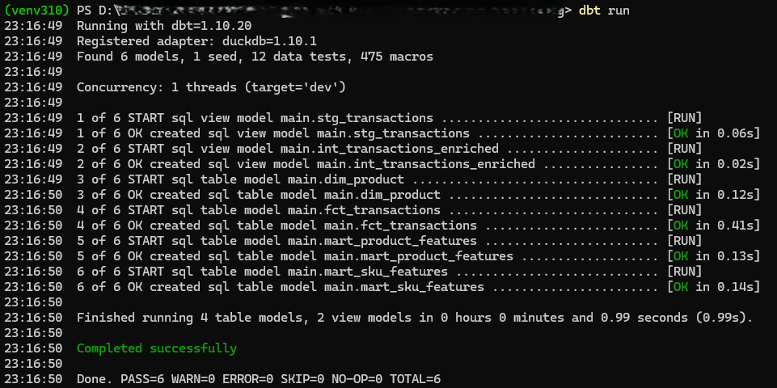
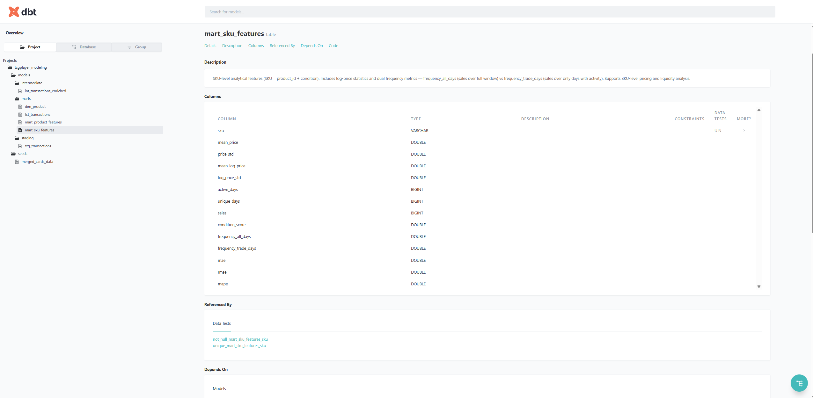

# TCGplayer Marketplace — dbt Analytics Layer

End-to-end analytics layer for a 1.9M+ row TCG (Trading Card Game) marketplace 
transaction dataset. Implements a Kimball-style star schema with dbt and DuckDB,
turning raw CSV transactions into BI-ready fact/dimension tables and feature 
tables for pricing strategy analysis.

> Companion to the upstream AWS pipeline (S3 + Glue Catalog + Athena) for 
> serverless ingestion and exploratory queries.

---

## 📊 Architecture


```
┌─────────────────────┐
│ merged_cards_data   │  Raw seed: ~1.9M marketplace transactions, 11 columns
│      (CSV seed)     │
└──────────┬──────────┘
           │
           ▼
┌─────────────────────┐
│  stg_transactions   │  Staging: type casting, trimming, multi-format date 
│       (view)        │  parsing, condition/foil/language label extraction
└──────────┬──────────┘
           │
           ▼
┌─────────────────────────────┐
│ int_transactions_enriched   │  Intermediate: derived fields (SKU, residual,
│           (view)            │  log price, price-to-market ratio)
└──────────┬──────────────────┘
           │
   ┌───────┼───────────────┬──────────────────────┐
   ▼       ▼               ▼                      ▼
┌──────┐ ┌─────────┐ ┌─────────────────────┐ ┌────────────────────┐
│ fct_ │ │  dim_   │ │ mart_product_       │ │ mart_sku_features  │
│trans │ │ product │ │     features        │ │                    │
│(table)│ │ (table) │ │      (table)        │ │      (table)       │
└──────┘ └─────────┘ └─────────────────────┘ └────────────────────┘
 Fact     Dimension   Product-level features   SKU-level features
                       (clustering/pricing)     (modeling/pricing)
```

---

## 🗂 Models

### `staging/stg_transactions`
Cleaned transaction data:
- `try_cast` numeric coercion (CSV loads numbers as VARCHAR)
- date standardization
- `Condition` string parsed into 4 derived labels:
  - `foil_status` (Foil / Non-Foil)
  - `condition_category` (Near Mint → Damaged)
  - `condition_score` (1–6 ordinal)
  - `language` (11 languages)
- Filters invalid prices, quantities, and missing keys

### `intermediate/int_transactions_enriched`
Cross-field derived features:
- **SKU** = `product_id + condition` (the true pricing unit)
- **Residual** = `unit_price − market_price` (deviation from market reference)
- **Log price** = `ln(unit_price + 1)` (for right-skewed price distribution)
- **Price-to-market ratio** = `unit_price / market_price`

### `marts/fct_transactions`
Transaction-level fact table. One row per order line. The main analytical entry 
point — BI tools and ad-hoc queries start here.

### `marts/dim_product`
Product dimension. One row per `product_id`. Contains product name, game set, 
and aggregate transaction/unit counts.

### `marts/mart_product_features`
Product-level feature table for segmentation and pricing strategy:
- **Pricing**: mean, std
- **Liquidity**: frequency (orders / active days), active days, total orders
- **Mix ratios**: Near Mint share, Foil share, English share, avg condition score
- **Forecast accuracy** (treating market price as baseline forecast): MAE, RMSE, MAPE

### `marts/mart_sku_features`
SKU-level feature table (`product_id + condition`). Same family of metrics as the 
product table, plus:
- **Log-price statistics** (mean, std)
- **Dual frequency metrics**:
  - `frequency_all_days` — sales over full time window (overall liquidity)
  - `frequency_trade_days` — sales over only days with activity (active-window intensity)
  
  Divergence between the two flags intermittent-bestseller SKUs that need 
  differentiated pricing.

---

## ✅ Data Quality Tests

12 dbt tests defined in `models/marts/schema.yml`:
- **Not-null** on all primary keys, foreign keys, and core measures
- **Unique** on dimension primary keys (`product_id`, `sku`)
- **Referential integrity** — every `fct_transactions.product_id` resolves to a 
  row in `dim_product`

```bash
dbt test
```

---

## 🛠 Tech Stack


| Layer    | Tool          |
|----------|---------------|
| Modeling | dbt-core 1.10 |
| Storage  | DuckDB (local OLAP) |
| Source   | TCG cards marketplace transactions |
| Companion pipeline | AWS S3 + Glue Data Catalog + Athena |

---

## 🚀 Run Locally

```bash
# 1. Set up environment
python -m venv venv
source venv/bin/activate          # Windows: .\venv\Scripts\activate
pip install dbt-duckdb

# 2. Place transaction CSV in seeds/
#    Expected file: seeds/merged_cards_data.csv

# 3. Build the warehouse
dbt seed     # load CSV
dbt run      # build all 6 models
dbt test     # run 12 quality tests

# 4. Explore lineage and docs
dbt docs generate
dbt docs serve
```
## Example Outputs

### AWS bucket layout


### Successful dbt build


### SKU-level feature mart


---

## 📁 Project Structure

```
tcgplayer_modeling/
├── dbt_project.yml
├── seeds/
│   └── merged_cards_data.csv
└── models/
    ├── staging/
    │   └── stg_transactions.sql
    ├── intermediate/
    │   └── int_transactions_enriched.sql
    └── marts/
        ├── fct_transactions.sql
        ├── dim_product.sql
        ├── mart_product_features.sql
        ├── mart_sku_features.sql
        └── schema.yml
```

---

## 🔗 Related Work

This dbt layer supports a broader pricing analytics project that also includes:
- HDBSCAN-based market behavior segmentation across 7 distinct clusters
- XGBoost + ARIMA ensemble forecasting on 6,335 SKUs
- AWS S3 + Athena workflow for serverless EDA on the same dataset
